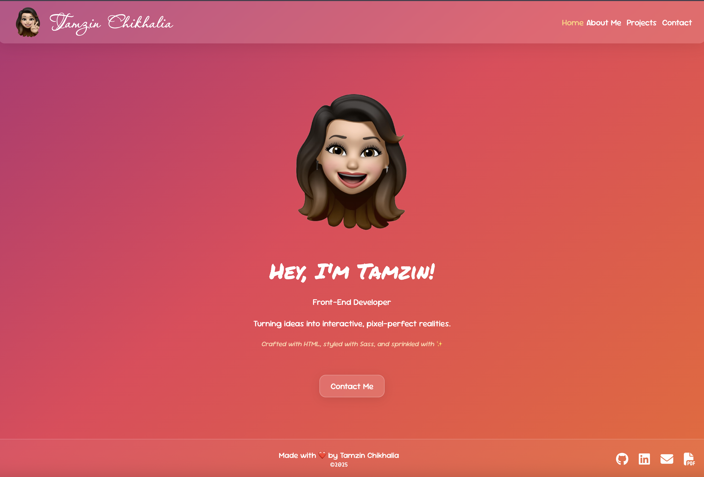

# react-portfolio

## Description

Using React, I have created a portfolio to showcase my projects that I have built using various programming languages and frameworks. It features fully functioning links to multiple pages, including useful links to my GitHub, LinkedIn, email and my CV, with also the addition of a contact form using event handling to capture data. 

## Installation

N/A

## Usage

You can view my porfolio [here.](https://tamzinc.github.io/react-portfolio/)

Once it loads, you'll be taken to the Home page which displays a profile image, title and the option to contact me.

Navigating through my portfolio is straightforward as all the nav links are diplayed in the header. To make it clear what page you are currently on, the text colour of the active nav link is yellow. You can also return to Home at any point by either clicking on 'Home', my name or my icon in the header.

In my About Me section you will be able to find icon links to my GitHub profile, LinkedIn page, email and a downloadable PDF copy of my CV.

My projects page has been split into two sections: professional projects that I have worked on and personal projects. For any of my personal projects you will be able to view the published live app if available as well as the live repo.

If you would like to look at my GitHub repo to view my code, please follow this link: https://github.com/TamzinC/react-portfolio.

## License
This project is licensed under the terms of the MIT license

## Credits

N/A
